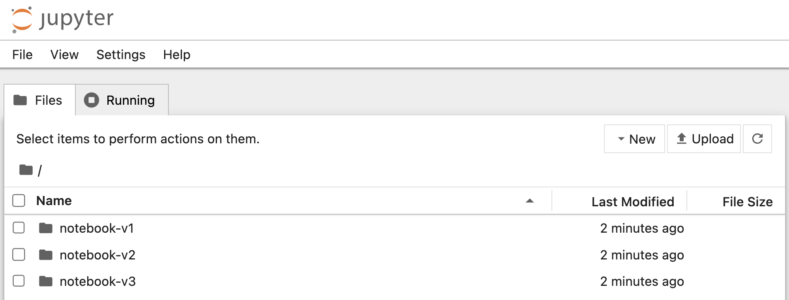

The typical way that Jupyter notebooks would be run is to run them directly on your own local computer. This involves having the Python language interpreter already installed on your computer.

If following best practice, you would first create a Python virtual environment in which to install the Jupyter notebook software. To do this, run:

```execute
python3 -m venv jupyter
```

Having created the Python virtual environment, activate it so the Python runtime from the Python virtual environment is used.

```execute
source jupyter/bin/activate
```

Before installing the Jupyter notebook software, ensure the latest version of ``pip`` is installed into the Python virtual environment by running:

```execute
pip install -U pip
```

You can now install the Jupyter notebook software by running:

```execute
pip install notebook
```

A version of the Jupyter notebook software was not specified when performing the installation, so the latest version will be used.

Although we aren't worrying about what versions of packages are installed here, in your own environments it is always recommended to track what versions you are installing so you can reproduce the environment later if need be.

When the the Jupyter notebook application is run, access will be gated using a password or access token. To set the password in advance so it is known, run:

```execute
jupyter notebook password
```

This will prompt you to enter the password and then confirm it. Enter:

```execute
jupyter
```

and then to verify it, again enter:

```execute
jupyter
```

This will update the file ``.jupyter/jupyter_notebook_config.json`` with a hash of the credentials. You can view the contents of the file by running:

```execute
cat .jupyter/jupyter_notebook_config.json
```

You can now start up the Jupyter notebook application by running:


```execute
jupyter notebook --ip 0.0.0.0
```

Note that because this workshop environment is running in Kubernetes, the argument ``--ip 0.0.0.0`` has been supplied. This is so the Jupyter notebook application can be accessed from outside of the Kubernetes cluster. If you ran the Jupyter notebook application on your own local computer you would not use this option, and instead let it default to using an IP for connections of ``127.0.0.1``. When ``127.0.0.1`` is used, it ensures that it is only accessible to you on your own local computer and not anyone else.

If you were running this command on your own local computer, your web browser would be automatically opened on the Jupyter notebook for you. As we are running the Jupyter notebook application in this hosted workshop environment, you will instead need to use the following URL to access it.

%ingress_protocol%://%session_namespace%-local-8888.%ingress_domain%/

Clicking on this URL should bring up a new browser window or tab. Log into the notebook using the password supplied above. You should see the file browser view of the Jupyter notebook application. The files and sub directories in the directory where you started the Jupyter notebook application will be visible.



Once you have verified the notebook application is working come back to these instructions and kill the Jupyter notebook application using:

```execute
<ctrl-c>
```

You will be prompted if you want to shutdown the application so confirm that you do using:

```execute
y
```

Note that you will only get 5 seconds to confirm shutdown, so if you aren't quick enough, repeat the process of killing the application.
