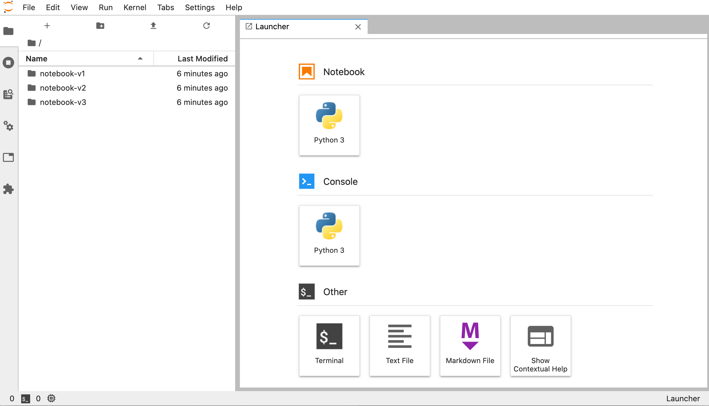

The Jupyter notebook interface you saw is what is called the classic interface. A more up to date interface for working with Jupyter notebooks is provided by the JupyterLab interface.

To use the JupyterLab interface, you first need to install it, as it is not bundled with the base Jupyter notebook package but is an extension. Install it by running:

```terminal:execute
command: pip install jupyterlab
```

You can now start up the Jupyter notebook again, but this time using the JupyterLab interface, by running:

```terminal:execute
command: jupyter lab --ip 0.0.0.0 --port 8888
```

Click on the URL again to bring up the JupyterLab interface.

{{ingress_protocol}}://{{session_namespace}}-local-8888.{{ingress_domain}}/

You shouldn't be asked to log in this time, but only because we are using the same URL and the new process has inherited the session cookie file that was previously written when we ran it with the classic interface.



You will see that JupyterLab provides an all in one interface where Jupyter notebooks are opened in the same page. In the classic interface, Jupyter notebooks were always opened in a new browser window or tab.

When you are done trying out the JupyterLab interface, kill the Jupyter notebook application using:

```terminal:interrupt
```

You will be prompted if you want to shutdown the application so confirm that you do using:

```terminal:execute
command: y
```
