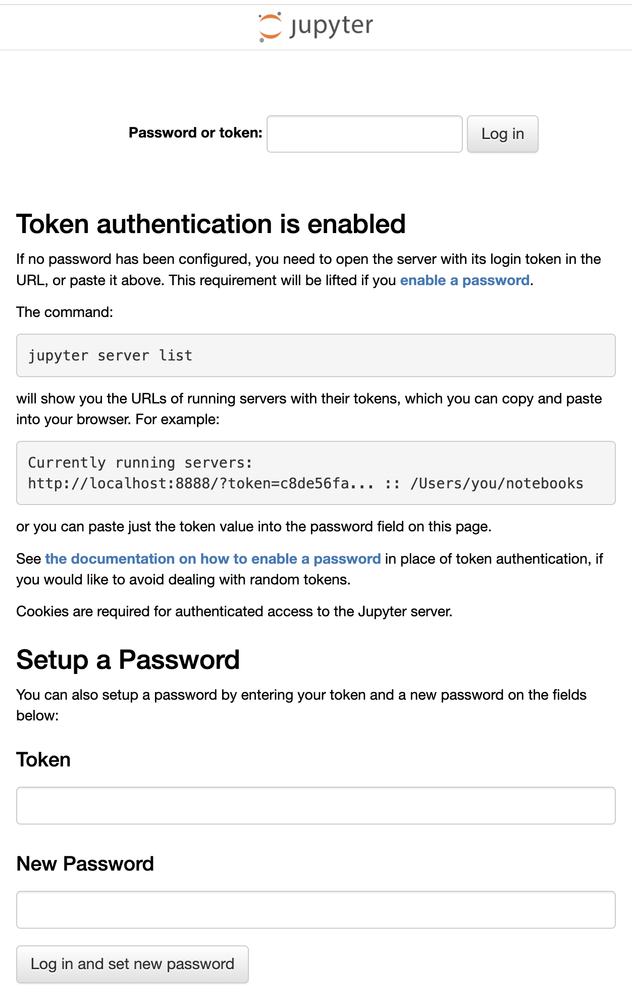

Where only a ``Deployment`` has been created, the only way to access the Jupyter notebook instance outside of the Kubernetes cluster is by using port forwarding. To set up port forwarding, run the command:

```execute-1
kubectl port-forward deployment/notebook 8888:8888
```

It will generate the output:

```
Forwarding from 127.0.0.1:8888 -> 8888
```

indicating port forwarding is active.

If this were being run on your own local computer, you could then access the Jupyter notebook application using the url ``http://127.0.0.1:8888``.

As we are running the Jupyter notebook application in this hosted workshop environment, you will instead need to again use the following URL to access it.

%ingress_protocol%://%session_namespace%-local-8888.%ingress_domain%/

Clicking on this URL to access the web interface for the Jupyter notebook, you will see that what it displays this time is quite different.



This is because we haven't been able to set a password, nor were we shown the URL with access token to use when accessing the Jupyter notebook application.

In order to work out what the access token is, we either have to look at the container logs kept by Kubernetes, or access the container to dump out a list of the Jupyter notebook instances.

To view the logs for the Jupyter notebook application, run:

```execute-2
kubectl logs deployment/notebook
```

You should see a section in the logs similar to:

```
To access the notebook, open this file in a browser:
    file:///home/jovyan/.local/share/jupyter/runtime/nbserver-7-open.html
Or copy and paste one of these URLs:
    http://notebook-5474d74498-ktcv6:8888/?token=68c199acba9a8feea241c15e156f00f0d788608355cda8a0
 or http://127.0.0.1:8888/?token=68c199acba9a8feea241c15e156f00f0d788608355cda8a0
 ```

To login to the Jupyter notebook application you would need to copy the access token shown in the logs and use it with the login page.

Instead of looking at the container logs, you can instead run:

```execute-2
kubectl exec deployment/notebook jupyter notebook list
```

This will display a list similar to:

```
Currently running servers:
http://0.0.0.0:8888/?token=68c199acba9a8feea241c15e156f00f0d788608355cda8a0 :: /home/jovyan
```

Again, you would need to copy the access token for use with the login page.

Having to work out what the access token is using either of these methods is not particularly convenient, nor is the need to setup port forwarding each time you need to access the Jupyter notebook.

Before we continue and look at solutions for improving on this, shutdown the port forwarding by running:

```execute-1
<ctrl-c>
```
